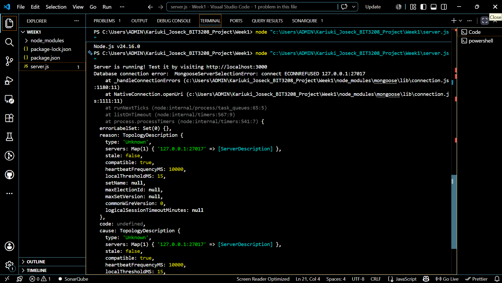
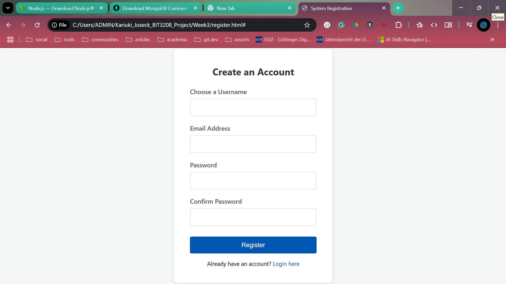
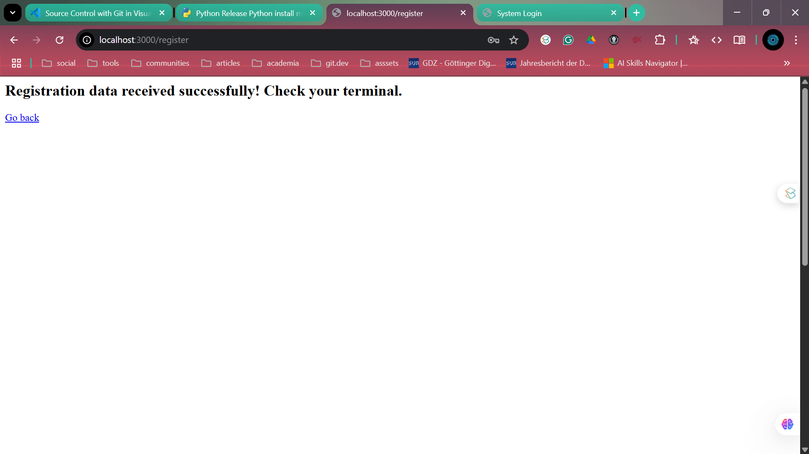
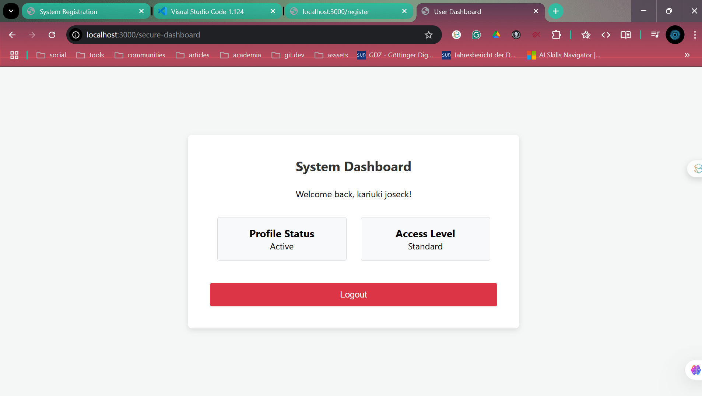
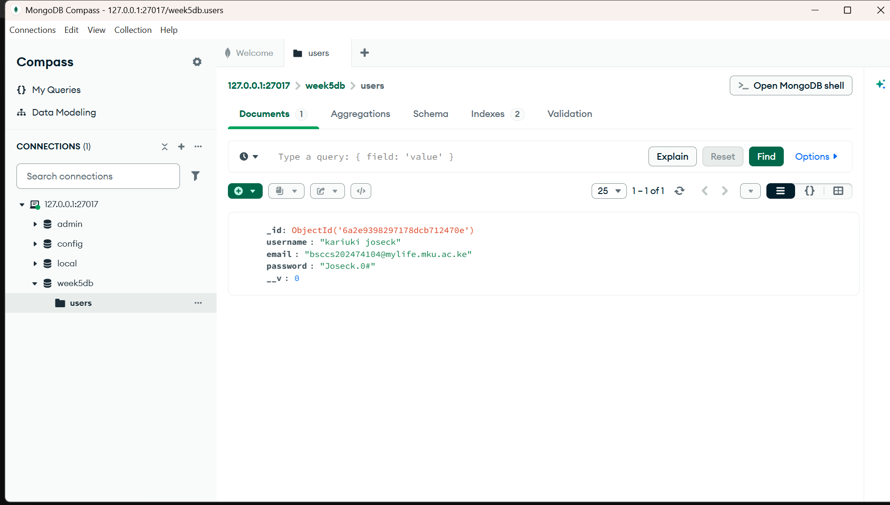
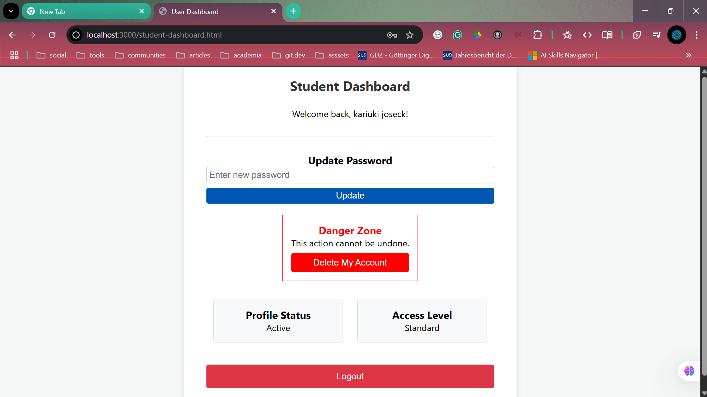
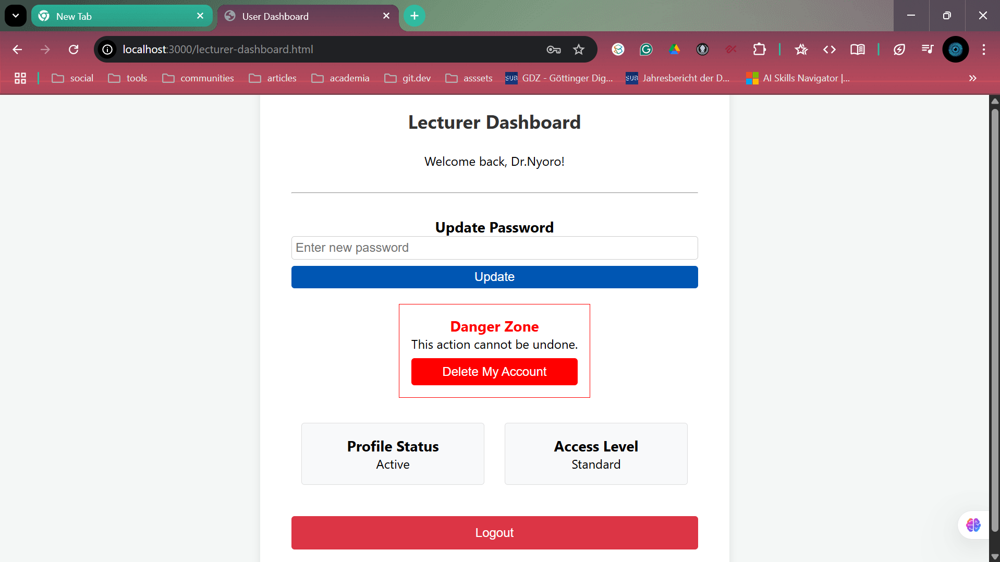
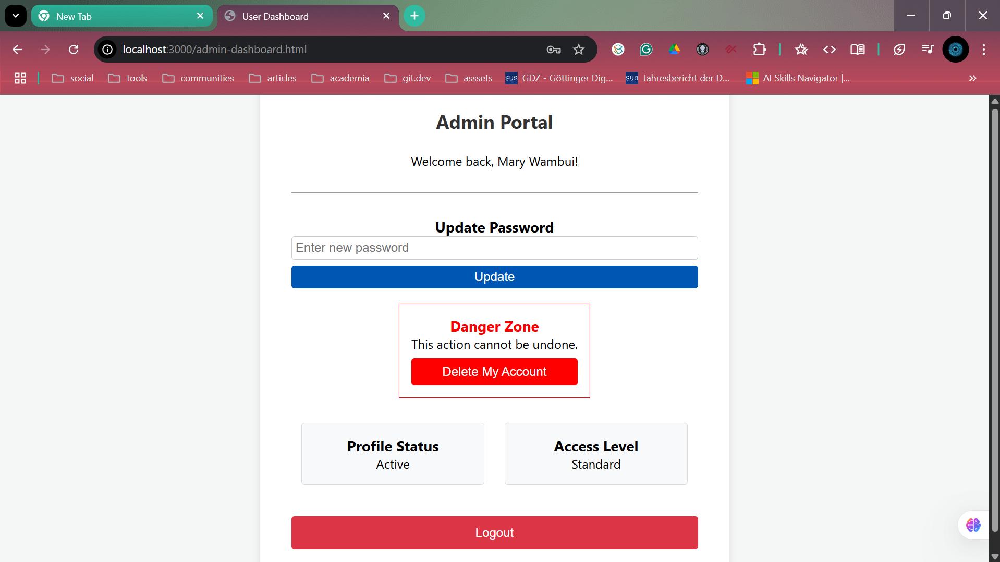
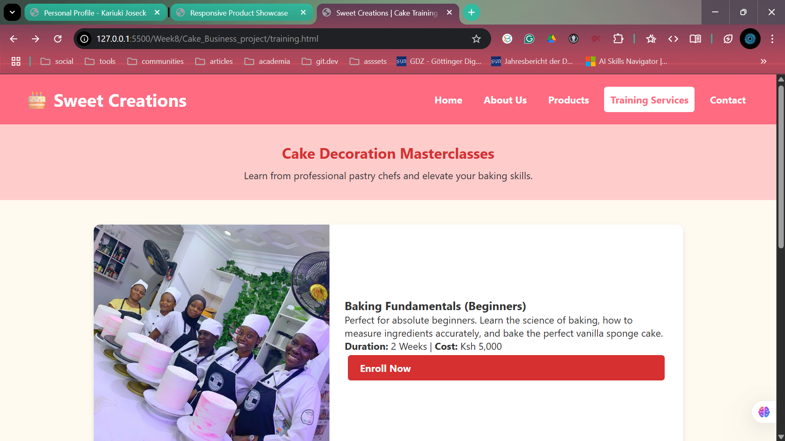

# Advanced Web Design and Development (BIT3208) - Project Logbook

**Developer:** Kariuki Joseck  
**Project:** Full-Stack User Authentication & CRUD System

---

## System Overview

A Node.js and Express backend application utilizing MongoDB for persistent data storage. The system features secure user registration, session-based authentication, and full CRUD (Create, Read, Update, Delete) capabilities.

---

## Weekly Development Log

### Week 1: Environment Setup

- **Objective:** Establish the local development environment and test core server capabilities.
- **Tasks Completed:** \* Installed Node.js and MongoDB.
  - Successfully initialized the project environment and tested localhost connectivity.
- **Evidence:**
  

### Week 2: Frontend Design & Planning

- **Objective:** Design the graphical user interface and plan the system architecture.
- **Tasks Completed:**
  - Designed interface wireframes.
  - Planned the request-response workflow between the client and the Express server.
- **Evidence:**
  

### Week 3: Client-Side Logic & Form Validation

- **Objective:** Implement client-side interactivity and secure input handling.
- **Tasks Completed:**
  - Wrote JavaScript for DOM manipulation.
  - Implemented front-end form validation to ensure data integrity before server submission.
- **Evidence:**
  

### Week 4: Server-Side Processing & Authentication

- **Objective:** Build the backend processing logic and secure authentication pipeline.
- **Tasks Completed:**
  - Configured Express server routing.
  - Processed POST requests for user registration and login forms.
  - Implemented secure session-based authentication to protect dashboard access.
- **Evidence:**
  

### Week 5: Database Integration & CRUD Operations

- **Objective:** Integrate a NoSQL database for persistent data storage and manipulation.
- **Tasks Completed:**
  - Connected Express server to MongoDB using Mongoose.
  - Created the foundational User schema.
  - Implemented full CRUD functionality: Create (registration), Read (login verification), Update (password modification), and Delete (account removal).
- **Challenges & Solutions:** \* Addressed initial database environment setup error by identifying and reinstalling the correct version of MongoDB.
- **Evidence:**
  

---

## Conclusion

The project successfully demonstrates a complete full-stack workflow, transitioning from static web interfaces to a dynamic, data-driven system using modern backend engineering practices and continuous version control via Git.

### Week 6: Database Integration and CRUD Operations

- **Objective:** Connect the web application to a database to persistently store and manipulate user data.
- **Tasks Completed:**
  - Configured a local MongoDB connection using the Mongoose ODM (`week6db`).
  - Designed the primary `User` model to structure incoming registration credentials.
  - Implemented backend routing for all CRUD operations: Create (registration), Read (login verification), Update (password modification), and Delete (account removal).
  - Authored a `database-schema.txt` document outlining the NoSQL architecture and data workflow.

  ### Week 7: User Authentication & Role-Based Access Control

- **Objective:** Secure the application with encrypted passwords, session management, and multi-user routing.
- **Tasks Completed:**
  - Installed `bcryptjs` and implemented password hashing for all new registrations.
  - Upgraded the MongoDB User schema to include `Student`, `Lecturer`, and `Administrator` roles.
  - Built protected routes that verify active sessions before serving dashboard pages.
  - Implemented secure logout functionality to destroy sessions.
- **Evidence:**
  
  
  

### Week 8: Responsive Web Design and Mobile-First Development

- **Objective:** Apply Mobile-First design principles, CSS Flexbox, and CSS Grid to create highly adaptable, multi-device frontend interfaces.
- **Tasks Completed:**
  - Designed a responsive Personal Profile interface utilizing fluid CSS Flexbox containers.
  - Developed a dynamic Product Showcase using CSS Grid with specific tablet and desktop media queries.
  - Architected a complete 5-page responsive website ("Sweet Creations Bakery") utilizing a reusable global layout shell and responsive navigation.
  - Implemented mobile-first CSS scaling to ensure zero horizontal overflow and seamless rendering across smartphones, tablets, and wide-screen monitors.
- **Evidence:**
  
